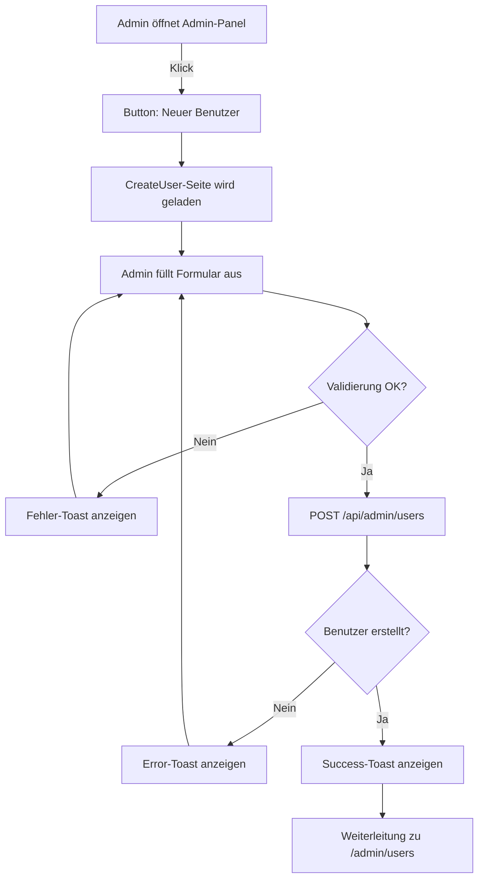

# Benutzer-Anlagefunktion - Dokumentation

## 📋 Übersicht

Die neue **Benutzer-Anlagefunktion** ermöglicht es Administratoren, neue Benutzer direkt im Admin-Panel mit allen verfügbaren Datenbankfeldern zu erstellen, statt zu warten, bis sich Benutzer selbst registrieren.

---

## 🎯 Funktionen

### Alle Datenbankfelder in einer Seite

**Persönliche Daten:**
- ✅ Name (erforderlich, min. 2 Zeichen)
- ✅ E-Mail (erforderlich, eindeutig)

**Anmeldedaten:**
- ✅ Passwort (erforderlich, min. 6 Zeichen)
- ✅ Passwort-Bestätigung

**Rollen & Status:**
- ✅ Rolle: Admin / Moderator / User / Gast
- ✅ Status: Aktiv / Ausstehend / Gesperrt

**Trainerlizenz:**
- ✅ Lizenzstufe: Keine / Hilfstrainer / C-Trainer / B-Trainer / A-Trainer
- ✅ Lizenznummer (erforderlich wenn Lizenz > Keine)
- ✅ Lizenzablaufdatum (optional)

---

## 🚀 Zugang

**URL:** `http://localhost:8080/admin/create-user`

**Button im Admin-Panel:** "Neuer Benutzer" (grün, oben rechts im Admin-Panel)

**Erforderliche Rolle:** Admin (nur Administratoren können Benutzer anlegen)

---

## 📝 Formular-Validierung

| Feld | Validierung | Fehler |
|------|-------------|--------|
| Name | Min. 2 Zeichen | "Name muss mindestens 2 Zeichen lang sein" |
| E-Mail | Gültige E-Mail-Adresse | "Gültige E-Mail-Adresse erforderlich" |
| E-Mail | Eindeutig in DB | "E-Mail-Adresse existiert bereits" |
| Passwort | Min. 6 Zeichen | "Passwort muss mindestens 6 Zeichen lang sein" |
| Passwort wiederholen | Stimmt überein | "Passwörter stimmen nicht überein" |
| Lizenznummer | Erforderlich wenn Lizenz > Keine | "Lizenznummer ist erforderlich bei Lizenzauswahl" |

---

## 🔌 API Endpoint

### POST `/api/admin/users`

**Authentifizierung:** Erfordert gültigen JWT-Token mit `Admin`-Rolle

**Request Body:**
```json
{
  "name": "Max Mustermann",
  "email": "max@example.com",
  "password": "secure123",
  "role": "User",
  "status": "active",
  "license_level": "C-Trainer",
  "license_number": "LIC-2024-001",
  "license_expires_at": "2025-12-31"
}
```

**Erforderliche Felder:**
- `name`
- `email`
- `password`

**Optionale Felder (mit Defaults):**
- `role` (default: "User")
- `status` (default: "active")
- `license_level` (default: "Keine")
- `license_number` (null wenn nicht angegeben)
- `license_expires_at` (null wenn nicht angegeben)

**Erfolgreiche Response (201):**
```json
{
  "message": "Benutzer erfolgreich erstellt.",
  "user": {
    "id": 7,
    "name": "Max Mustermann",
    "email": "max@example.com",
    "role": "User",
    "status": "active",
    "license_level": "C-Trainer",
    "license_number": "LIC-2024-001",
    "license_expires_at": "2025-12-31T00:00:00.000Z",
    "created_at": "2026-09-01T10:18:07.420Z"
  }
}
```

**Error Response (400):**
```json
{
  "message": "E-Mail-Adresse existiert bereits."
}
```

---

## 🎨 Frontend Komponenten

### [CreateUser.js](../frontend/src/pages/CreateUser.js)
- Formular mit Feldern für alle Benutzerattribute
- Formular-Validierung auf Client-Seite
- Toast-Benachrichtigungen für Erfolg/Fehler
- Automatische Weiterleitung zur Benutzerliste nach Erfolg
- Responsive Design (Mobile/Tablet/Desktop)

### [CreateUser.css](../frontend/src/styles/CreateUser.css)
- Benutzerdefinierten Styling für Formular
- Fieldsets für logische Gruppierung
- Responsive Mobile-Unterstützung
- Bootstrap 5 Integration

---

## ⚙️ Backend Implementation

### POST-Route in [admin.js](../backend/routes/admin.js)

```javascript
router.post('/users', verifyToken, verifyRoles('Admin'), async (req, res) => {
  // 1. Validiert erforderliche Felder (name, email, password)
  // 2. Hasht das Passwort mit bcryptjs (10 Rounds)
  // 3. Normalisiert E-Mail zu Kleinbuchstaben
  // 4. Erstellt Benutzer in PostgreSQL
  // 5. Protokolliert Aktion im Audit-Log (wenn Middleware aktiv)
  // 6. Gibt neu erstellten Benutzer zurück
});
```

---

## 🔐 Sicherheitsmerkmale

✅ **JWT-Authentifizierung** - Nur angemeldete Admins können Benutzer erstellen  
✅ **Rollenprüfung** - `verifyRoles('Admin')`  
✅ **Passwort-Hashing** - bcryptjs mit 10 Runden  
✅ **E-Mail-Normalisierung** - Verhindert Duplikate durch Kleinbuchstaben  
✅ **Eingabe-Validierung** - Frontend & Backend  
✅ **SQL-Injection-Schutz** - Prepared Statements  
✅ **Audit-Logging** - Admin-Aktion wird protokolliert

---

## 📱 Benutzer-Workflow



---

## 📊 Testbeispiel

### Mit cURL:
```bash
curl -X POST "http://localhost:5000/api/admin/users" \
  -H "Authorization: Bearer YOUR_TOKEN" \
  -H "Content-Type: application/json" \
  -d '{
    "name": "Anna Schmidt",
    "email": "anna.schmidt@hpv.de",
    "password": "sicheresPW2024",
    "role": "Moderator",
    "status": "active",
    "license_level": "B-Trainer",
    "license_number": "BT-2024-015",
    "license_expires_at": "2025-06-30"
  }'
```

### Mit PowerShell (Windows):
```powershell
$token = (Invoke-WebRequest -Uri "http://localhost:5000/api/auth/login" -Method POST `
  -Body (@{email="admin@hpv.local"; password="admin123"} | ConvertTo-Json) `
  -ContentType "application/json" | ConvertFrom-Json).token

Invoke-WebRequest -Uri "http://localhost:5000/api/admin/users" -Method POST `
  -Headers @{"Authorization"="Bearer $token"} `
  -Body (@{
    name="Anna Schmidt"
    email="anna.schmidt@hpv.de"
    password="sicheresPW2024"
    role="Moderator"
    status="active"
    license_level="B-Trainer"
    license_number="BT-2024-015"
    license_expires_at="2025-06-30"
  } | ConvertTo-Json) `
  -ContentType "application/json"
```

---

## 🐛 Häufige Probleme

| Problem | Ursache | Lösung |
|---------|---------|--------|
| "Unauthorized" bei POST | Token abgelaufen oder Rolle nicht Admin | Neu anmelden, Token prüfen |
| "E-Mail existiert bereits" | E-Mail-Adresse ist nicht eindeutig | Andere E-Mail verwenden |
| "Lizenznummer erforderlich" | Lizenz ausgewählt aber Nummer leer | Lizenznummer eingeben |
| Button nicht sichtbar | Nicht als Admin angemeldet | Als Admin anmelden |

---

## 📝 Version & Änderungen

**Hinzugefügt in:** v2.1.0  
**Commit:** `6dd38c2`  
**Datum:** 2026-09-01

**Neue Dateien:**
- `frontend/src/pages/CreateUser.js` - React-Komponente
- `frontend/src/styles/CreateUser.css` - Styling

**Modifizierte Dateien:**
- `backend/routes/admin.js` - Neue POST-Route
- `frontend/src/App.js` - Neue Route & Import
- `frontend/src/pages/AdminPanel.js` - Button-Link

---

## 🔄 Verwandte Features

- [Benutzerprofile](../ADMIN-HANDBUCH.md#benutzerverwaltung) - Vorhandene Benutzer bearbeiten
- [Benutzerfreischaltung](../ADMIN-HANDBUCH.md#ausstehende-freischaltung) - Registrierungen genehmigen
- [Rollen & Berechtigungen](../ADMIN-HANDBUCH.md#rollen--berechtigungen) - Admin/Moderator/User

---

**Dokumentation:** Abgeschlossen  
**Status:** ✅ Produktionsreif
