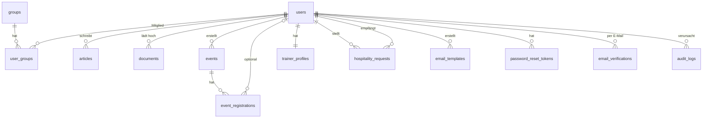

# Datenbankschema

PostgreSQL 15. Das **vollständige Schema und die Seed-Daten** liegen inline in
`backend/database.js` (`initDb()`). Alle Tabellen werden beim Backend-Start per
`CREATE TABLE IF NOT EXISTS` angelegt; nachträgliche Spalten kommen über
`ALTER TABLE … ADD COLUMN IF NOT EXISTS` (in den Tabellen unten mit *„ALTER"* markiert).

Kürzel: `timestamptz` = `TIMESTAMP WITH TIME ZONE`, „now" = `DEFAULT CURRENT_TIMESTAMP`,
`serial` = auto-increment-Integer.

## Beziehungen

---

## Benutzer & Gruppen

### `users`

| Feld | Typ | Constraints / Default |
|---|---|---|
| id | serial | **PK** |
| email | varchar(255) | UNIQUE, NOT NULL |
| password | varchar(255) | NOT NULL — bcrypt-Hash |
| name | varchar(255) | NOT NULL |
| role | varchar(50) | DEFAULT `'User'` — `Admin` / `Moderator` / `User` / `Gast` |
| status | varchar(50) | DEFAULT `'pending'` — `pending` / `active` / `blocked` |
| license_level | varchar(50) | DEFAULT `'Keine'`, CHECK IN (`Keine`, `Hilfstrainer`, `C-Trainer`, `B-Trainer`, `A-Trainer`) |
| license_number | varchar(100) | |
| license_expires_at | date | |
| strasse | varchar(255) | *ALTER* — optionale Adresse |
| plz | varchar(20) | *ALTER* |
| ort | varchar(255) | *ALTER* |
| created_at | timestamptz | DEFAULT now |

### `groups`

| Feld | Typ | Constraints / Default |
|---|---|---|
| id | serial | **PK** |
| name | varchar(255) | UNIQUE, NOT NULL |
| description | text | |
| created_by | int | FK → `users(id)` ON DELETE SET NULL |
| created_at | timestamptz | DEFAULT now |

### `user_groups`

Zuordnung Benutzer ↔ Gruppe (n:m).

| Feld | Typ | Constraints / Default |
|---|---|---|
| id | serial | **PK** |
| user_id | int | FK → `users(id)` ON DELETE CASCADE |
| group_id | int | FK → `groups(id)` ON DELETE CASCADE |
| joined_at | timestamptz | DEFAULT now |
| | | UNIQUE(`user_id`, `group_id`) |

---

## Inhalte

### `articles` (News)

| Feld | Typ | Constraints / Default |
|---|---|---|
| id | serial | **PK** |
| title | varchar(255) | NOT NULL |
| content | text | NOT NULL — einfaches HTML/Markup erlaubt |
| image_path | varchar(500) | *ALTER* — Titelbild im `uploads/`-Verzeichnis |
| author_id | int | FK → `users(id)` ON DELETE SET NULL |
| status | varchar(50) | DEFAULT `'published'` |
| created_at | timestamptz | DEFAULT now |

### `documents`

| Feld | Typ | Constraints / Default |
|---|---|---|
| id | serial | **PK** |
| title | varchar(255) | NOT NULL |
| file_path | varchar(500) | NOT NULL — Dateiname in `uploads/` (Zufallsname, keine Endung) |
| category | varchar(100) | DEFAULT `'General'` |
| uploaded_by | int | FK → `users(id)` ON DELETE SET NULL |
| file_size | int | *ALTER* — DEFAULT 0 (Bytes) |
| file_type | varchar(50) | *ALTER* — DEFAULT `'unknown'` (Dateiendung) |
| created_at | timestamptz | DEFAULT now |

### `legal_texts`

Impressum, Datenschutz, AGB. Werden geseedet, aber im Admin-Panel editierbar.

| Feld | Typ | Constraints / Default |
|---|---|---|
| key | varchar(50) | **PK** — `impressum` / `datenschutz` / `agb` |
| title | varchar(255) | NOT NULL |
| content | text | NOT NULL — Markdown |
| updated_at | timestamptz | DEFAULT now |

---

## Events

### `events`

| Feld | Typ | Constraints / Default |
|---|---|---|
| id | serial | **PK** |
| title | varchar(255) | NOT NULL |
| description | text | |
| date | date | NOT NULL |
| time | time | NOT NULL |
| location | varchar(255) | |
| agenda | text | |
| max_participants | int | NOT NULL, DEFAULT 0 (0 = unbegrenzt) |
| created_by | int | FK → `users(id)` ON DELETE SET NULL |
| created_at | timestamptz | DEFAULT now |
| updated_at | timestamptz | DEFAULT now |
| | | INDEX `idx_events_date` auf `date` |

`date` + `time` dienen zugleich als Anmeldeschluss — kein separates Deadline-Feld.

### `event_registrations`

| Feld | Typ | Constraints / Default |
|---|---|---|
| id | serial | **PK** |
| event_id | int | NOT NULL, FK → `events(id)` ON DELETE CASCADE |
| user_id | int | FK → `users(id)` ON DELETE SET NULL — NULL bei Gast-Anmeldung |
| name | varchar(255) | NOT NULL |
| email | varchar(255) | NOT NULL |
| verein | varchar(255) | |
| has_license | bool | NOT NULL, DEFAULT false |
| experience_level | varchar(50) | NOT NULL, DEFAULT `'Anfänger'`, CHECK IN (`Anfänger`, `Fortgeschritten`, `Erfahren`, `Experte`) |
| description | text | |
| status | varchar(50) | NOT NULL, DEFAULT `'pending'`, CHECK IN (`pending`, `accepted`, `rejected`) |
| registered_at | timestamptz | DEFAULT now |
| | | UNIQUE(`event_id`, `email`); INDEX `idx_event_registrations_event_id` |

---

## Trainer-Verzeichnis & Hospitieren

### `trainer_profiles`

Ein Profil pro Benutzer (Upsert über `user_id`).

| Feld | Typ | Constraints / Default |
|---|---|---|
| id | serial | **PK** |
| user_id | int | **UNIQUE**, NOT NULL, FK → `users(id)` ON DELETE CASCADE |
| verein | varchar(255) | |
| region | varchar(255) | |
| has_license | bool | NOT NULL, DEFAULT false |
| experience_level | varchar(50) | NOT NULL, DEFAULT `'Anfänger'`, CHECK IN (`Anfänger`, `Fortgeschritten`, `Erfahren`, `Experte`) |
| description | text | |
| is_visible | bool | NOT NULL, DEFAULT true — Sichtbarkeit im öffentlichen Verzeichnis |
| accepts_hospitality | bool | NOT NULL, DEFAULT true — nimmt Hospitier-Anfragen an |
| created_at | timestamptz | DEFAULT now |
| updated_at | timestamptz | DEFAULT now |

### `hospitality_requests`

| Feld | Typ | Constraints / Default |
|---|---|---|
| id | serial | **PK** |
| requester_id | int | NOT NULL, FK → `users(id)` ON DELETE CASCADE — stellt die Anfrage |
| host_id | int | NOT NULL, FK → `users(id)` ON DELETE CASCADE — wird hospitiert |
| message | text | |
| status | varchar(50) | NOT NULL, DEFAULT `'pending'`, CHECK IN (`pending`, `accepted`, `rejected`, `confirmed`) |
| date_proposed | date | vom Anfragenden vorgeschlagen |
| date_confirmed | date | vom Host bestätigt |
| location | varchar(255) | |
| notes | text | |
| created_at | timestamptz | DEFAULT now |
| updated_at | timestamptz | DEFAULT now |
| | | INDEX `idx_hospitality_requester` (`requester_id`), `idx_hospitality_host` (`host_id`) |

Übergänge (in der App erzwungen, siehe [WORKFLOWS.md](WORKFLOWS.md#hospitieren-trainer-shadowing)):
`pending → accepted/rejected → confirmed`, keine Rück-Übergänge.

---

## Kommunikation

### `email_templates`

12 Textbausteine, geseedet aus `backend/data/emailTemplates.js`, im Admin-Panel voll editierbar.

| Feld | Typ | Constraints / Default |
|---|---|---|
| id | serial | **PK** |
| name | varchar(100) | UNIQUE, NOT NULL — technischer Schlüssel, `^[a-z0-9_]+$`, unveränderlich nach Anlegen |
| subject | varchar(255) | NOT NULL — mit `{{platzhaltern}}` |
| content | text | NOT NULL — Text mit `**fett**`, Zeilenumbrüchen, `{{platzhaltern}}` |
| created_by | int | FK → `users(id)` ON DELETE SET NULL |
| created_at | timestamptz | DEFAULT now |
| variables | jsonb | *ALTER* — NOT NULL, DEFAULT `'[]'` — bei jedem Speichern aus subject+content abgeleitet |
| updated_at | timestamptz | *ALTER* — DEFAULT now |

### `whatsapp_groups`

| Feld | Typ | Constraints / Default |
|---|---|---|
| id | serial | **PK** |
| name | varchar(255) | NOT NULL |
| invite_link | varchar(500) | NOT NULL — `https://chat.whatsapp.com/…` |
| description | text | |
| created_at | timestamptz | DEFAULT now |

### `contact_messages`

| Feld | Typ | Constraints / Default |
|---|---|---|
| id | serial | **PK** |
| name | varchar(255) | NOT NULL |
| email | varchar(255) | NOT NULL |
| subject | varchar(255) | NOT NULL |
| message | text | NOT NULL |
| status | varchar(50) | DEFAULT `'new'`, CHECK IN (`new`, `read`, `answered`, `archived`) *(Constraint per ALTER neu gesetzt)* |
| created_at | timestamptz | DEFAULT now |

---

## Auth & System

### `password_reset_tokens`

| Feld | Typ | Constraints / Default |
|---|---|---|
| id | serial | **PK** |
| user_id | int | FK → `users(id)` ON DELETE CASCADE |
| token | varchar(255) | NOT NULL |
| expires_at | timestamptz | NOT NULL — 24 h Gültigkeit |

### `email_verifications`

| Feld | Typ | Constraints / Default |
|---|---|---|
| id | serial | **PK** |
| email | varchar(255) | NOT NULL |
| token | varchar(255) | UNIQUE, NOT NULL |
| expires_at | timestamptz | NOT NULL — 24 h Gültigkeit |
| created_at | timestamptz | DEFAULT now |

### `system_settings`

Key/Value-Store, u. a. für die SMTP-Zugangsdaten (`smtp_host`, `smtp_port`, `smtp_user`, `smtp_pass`).

| Feld | Typ | Constraints / Default |
|---|---|---|
| key | varchar(100) | **PK** |
| value | text | NOT NULL |

### `audit_logs`

Protokoll der Admin-/Template-Aktionen.

| Feld | Typ | Constraints / Default |
|---|---|---|
| id | serial | **PK** |
| user_id | int | FK → `users(id)` ON DELETE SET NULL |
| action | varchar(100) | NOT NULL — z. B. `SEND_TEMPLATE`, `CREATE_TEMPLATE` |
| resource_type | varchar(100) | z. B. `email_template`, `user` |
| resource_id | int | |
| old_values | jsonb | |
| new_values | jsonb | |
| ip_address | varchar(50) | |
| user_agent | text | |
| status | varchar(50) | DEFAULT `'success'` |
| error_message | text | |
| created_at | timestamptz | DEFAULT now |
| | | INDEX `idx_audit_logs_created_at` (`created_at DESC`), `idx_audit_logs_user_id`, `idx_audit_logs_action` |

---

## Enum-artige CHECK-Constraints (Überblick)

| Tabelle.Feld | erlaubte Werte |
|---|---|
| `users.role` | Admin, Moderator, User, Gast *(kein CHECK, per Konvention)* |
| `users.status` | pending, active, blocked *(kein CHECK)* |
| `users.license_level` | Keine, Hilfstrainer, C-Trainer, B-Trainer, A-Trainer |
| `event_registrations.experience_level` / `trainer_profiles.experience_level` | Anfänger, Fortgeschritten, Erfahren, Experte |
| `event_registrations.status` | pending, accepted, rejected |
| `hospitality_requests.status` | pending, accepted, rejected, confirmed |
| `contact_messages.status` | new, read, answered, archived |

## Seed-Daten (nur auf frischer DB)

- Gruppe `Mitglieder`
- `legal_texts`: `impressum`, `datenschutz`, `agb` (`ON CONFLICT (key) DO NOTHING`)
- 1 Test-Event `Trainings-Community 24.10.26`
- 12 `email_templates` (`ON CONFLICT (name) DO NOTHING`)
- Standard-Konten `admin@trainer.local` / `moderator@trainer.local` — **nur wenn noch kein
  Admin bzw. Moderator existiert** (`WHERE NOT EXISTS …`)

**Stand:** 2026-09-09
