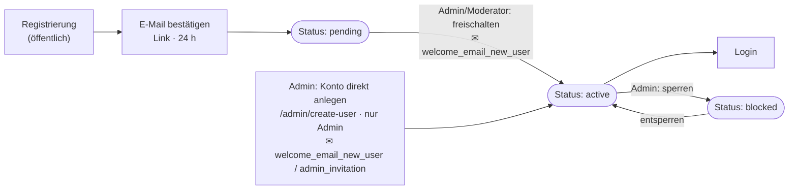
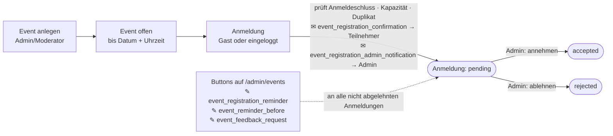
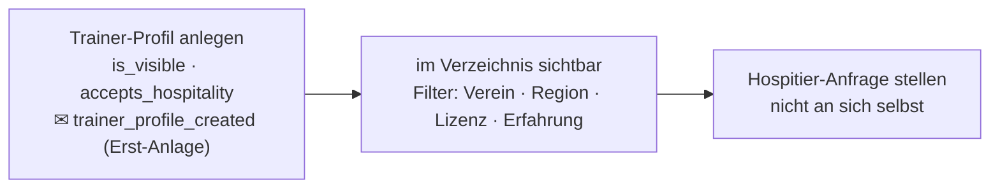
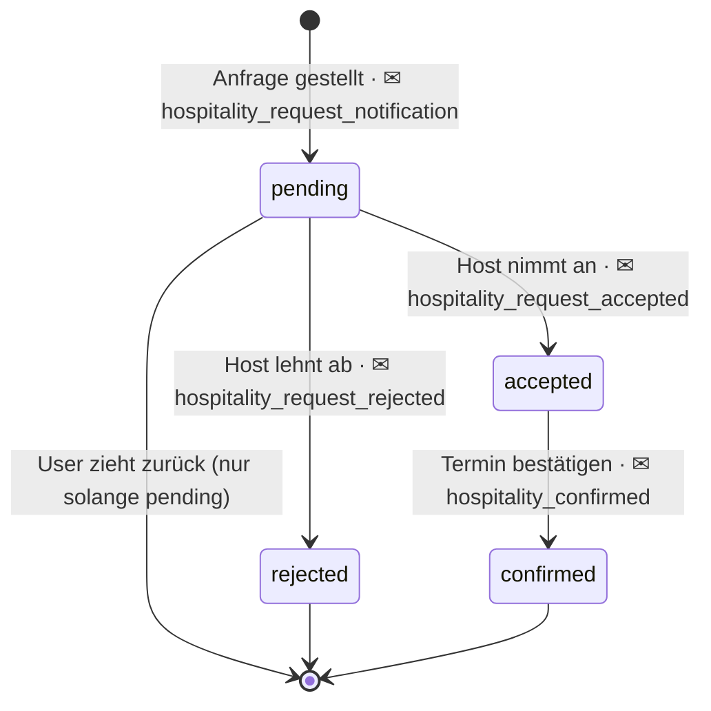
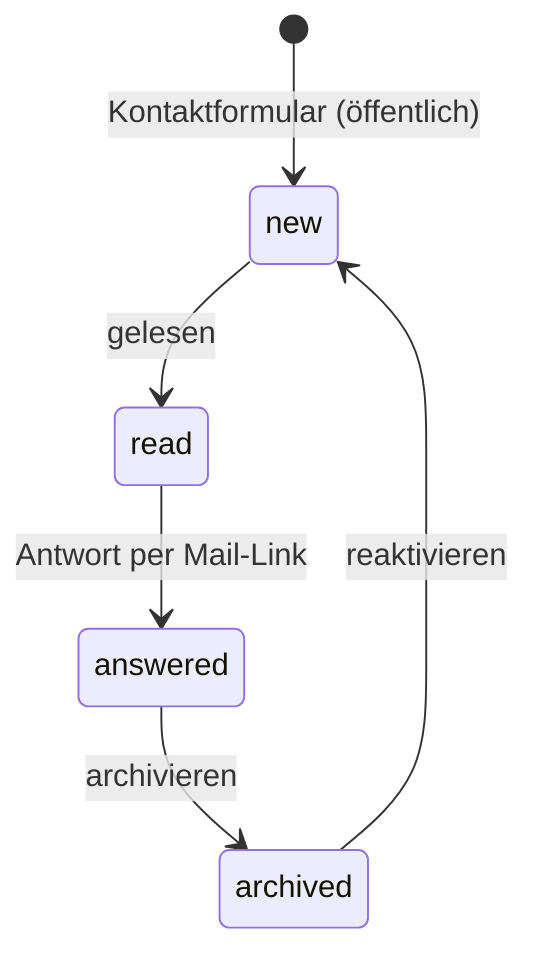
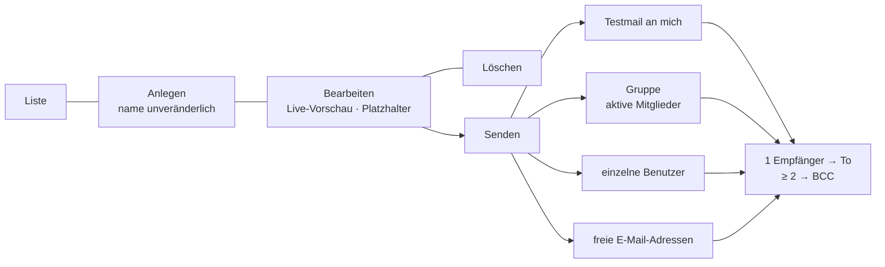
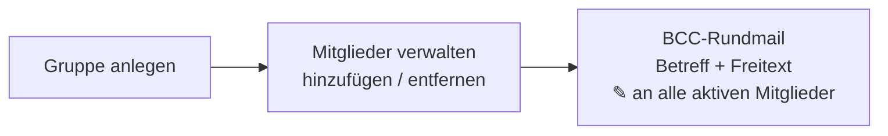
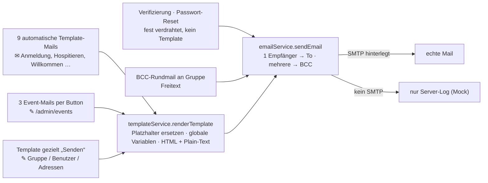

# Workflows im HPV-Trainer-Portal

Übersicht der mehrstufigen Abläufe, die die Plattform selbst führt – mit Statuswechseln
und den E-Mails, die dabei automatisch verschickt werden.

**Legende**

| Zeichen | Bedeutung |
|---|---|
| `(Status)` | Zustand eines Datensatzes (Benutzer, Anmeldung, Anfrage …) |
| ✉ | automatisch verschickte Template-Mail |
| ✎ | manuell (per Button) ausgelöste Mail |

> Ohne hinterlegte SMTP-Zugangsdaten läuft der Versand im **Mock-Modus**: Mails werden nur
> ins Server-Log geschrieben, nicht wirklich verschickt. Siehe [E-Mail-Pipeline](#e-mail-pipeline).

---

## Abläufe mit Statuswechsel

### Konto-Lebenszyklus

Von der Registrierung bis zum freigeschalteten Login. Konten werden **nie automatisch aktiv** –
ein Admin oder Moderator schaltet frei.

Passwort vergessen: `POST /api/auth/forgot-password` → Reset-Link (24 h) → `POST /api/auth/reset-password`.

| | |
|---|---|
| **Rollen** | öffentlich (registrieren) · Admin/Moderator (freischalten) · Admin (Direktanlage, sperren) |
| **Status** | `pending → active → blocked` (blocked ↔ active) |
| **Endpunkte** | `POST /api/auth/register`, `/verify-email`, `/forgot-password`, `/reset-password` · `POST /api/admin/users/:id/approve`, `/block` · `POST /api/admin/users` |
| **E-Mails** | Bestätigungslink & Reset-Link (fest verdrahtet, kein Template) · `welcome_email_new_user` · `admin_invitation` |

---

### Event-Anmeldung

Öffentliche Anmeldung zu Trainings-Events. Die Anmeldung wird serverseitig gegen
Anmeldeschluss, Kapazität und Doppelanmeldung geprüft.

| | |
|---|---|
| **Rollen** | öffentlich (anmelden) · Admin/Moderator (Event- und Anmeldungs­verwaltung) |
| **Status** | `pending → accepted / rejected` |
| **Endpunkte** | `POST/PUT/DELETE /api/events[/:id]` · `POST /api/events/:id/register` · `PUT /api/admin/event-registrations/:id/status` · `GET /api/admin/event-registrations/:eventId/export` (CSV) · `POST /api/admin/events/:id/{send-reminder, send-feedback-request, send-registration-reminder}` |
| **E-Mails** | `event_registration_confirmation`, `event_registration_admin_notification` (automatisch) · `event_registration_reminder`, `event_reminder_before`, `event_feedback_request` (manuell) |

---

### Hospitieren (Trainer-Shadowing)

Ein:e Trainer:in begleitet eine:n andere:n im Training. Anfrage-Workflow zwischen zwei im
Verzeichnis sichtbaren Trainer-Profilen.

Keine Rück-Übergänge – `pending → accepted/rejected → confirmed` ist die einzige Richtung.

| | |
|---|---|
| **Rollen** | eingeloggte Nutzer (Profil, Anfrage, Host-Aktionen) · Admin (Übersicht, löschen) |
| **Status** | `pending → accepted / rejected → confirmed` |
| **Endpunkte** | `PUT /api/trainer-profiles/me` · `GET /api/trainer-profiles` · `POST /api/hospitality` · `PUT /api/hospitality/:id/{accept, reject, confirm}` · `DELETE /api/hospitality/:id` (nur `pending`) · `GET /api/admin/hospitality` |
| **E-Mails** | `trainer_profile_created` · `hospitality_request_notification` · `hospitality_request_accepted` · `hospitality_request_rejected` · `hospitality_confirmed` |

---

### Kontaktanfragen

Nachrichten aus dem öffentlichen Kontaktformular landen im Admin-Posteingang.

| | |
|---|---|
| **Rollen** | öffentlich (senden) · Admin/Moderator (Posteingang) |
| **Status** | `new → read → answered → archived` (archived ↔ new) |
| **Endpunkte** | `POST /api/contact` · `GET /api/contact` · `PUT /api/contact/:id/status` · `DELETE /api/contact/:id` |
| **E-Mails** | keine (Antwort läuft über den `mailto:`-Link im Mailprogramm) |

---

## Verwaltung & Kommunikation

### E-Mail-Templates

Die 12 Textbausteine im Admin-Panel verwalten – und jedes Template **gezielt verschicken**,
unabhängig von seinem automatischen Auslöser.

| | |
|---|---|
| **Rollen** | Admin **und** Moderator |
| **Endpunkte** | `GET/POST/PUT/DELETE /api/admin/templates[/:id]` · `POST /api/admin/templates/:id/send` |
| **Serverseitig** | `variables` (JSONB, aus Betreff + Inhalt abgeleitet) · `updated_at` · Audit-Aktion `SEND_TEMPLATE` |

### Gruppen & Rundmail

| | |
|---|---|
| **Rollen** | Admin/Moderator |
| **Endpunkte** | `POST /api/admin/groups` · `GET/POST/DELETE /api/admin/groups/:id/members[/:userId]` · `POST /api/admin/groups/:id/send-email` · `GET/POST/DELETE /api/admin/whatsapp[/:id]` |

### Redaktion: News & Dokumente

Klassische Inhaltspflege ohne Statuswechsel – sofort öffentlich, keine E-Mail.

- **News** anlegen/ändern/löschen (Titelbild, einfache `**fett**`-Formatierung) → öffentlich im Feed
- **Dokumente** hochladen/löschen → öffentliche Vorschau (PDF, Bild, Text, `.docx`) + Download
- Endpunkte: `POST/PUT/DELETE /api/news[/:id]` · `POST /api/documents` · `DELETE /api/documents/:id` · `GET /api/documents/view/:id`

### Konfiguration

- **Rechtstexte** (Impressum · Datenschutz · AGB) bearbeiten → sofort öffentlich – *nur Admin*
- **SMTP-Zugang** setzen → schaltet den Mock-Modus auf echten Versand – *nur Admin*
- **Audit-Log** ansehen – *nur Admin*
- Endpunkte: `PUT /api/admin/legal/:key` · `POST /api/admin/settings/smtp` · `GET /api/admin/audit-logs`

---

## E-Mail-Pipeline

Jede E-Mail – automatisch, manuell oder gezielt gesendet – läuft durch dieselbe Kette.

**Immer verfügbare Platzhalter** (in jedem Template, ohne dass sie gesetzt werden müssen):
`{{current_year}}`, `{{platform_name}}`, `{{platform_url}}`, `{{support_email}}`, `{{admin_email}}`.

### Die 12 Templates und ihr Auslöser

| Template | Auslöser | Art |
|---|---|---|
| `event_registration_confirmation` | nach Event-Anmeldung, an Teilnehmer | automatisch |
| `event_registration_admin_notification` | nach Event-Anmeldung, an Admin | automatisch |
| `event_registration_reminder` | Button „Anmelde-Erinnerung“ | manuell |
| `event_reminder_before` | Button „Vor-Event-Erinnerung“ | manuell |
| `event_feedback_request` | Button „Feedback-Anfrage“ | manuell |
| `hospitality_request_notification` | Hospitier-Anfrage gestellt, an Host | automatisch |
| `hospitality_request_accepted` | Host nimmt an | automatisch |
| `hospitality_request_rejected` | Host lehnt ab | automatisch |
| `hospitality_confirmed` | Termin bestätigt, an beide | automatisch |
| `trainer_profile_created` | erstes Trainer-Profil angelegt | automatisch |
| `welcome_email_new_user` | Konto freigeschaltet | automatisch |
| `admin_invitation` | Rolle Admin/Moderator zugewiesen | automatisch |

Zusätzlich lässt sich **jedes** dieser Templates über *Admin-Panel → E-Mail-Templates → Senden*
ad hoc verschicken. Nicht als Template geführt: E-Mail-Verifizierung, Passwort-Reset-Link und
die BCC-Rundmail (Freitext).

---

## Technische Einordnung

- Backend: die Templates werden aus `backend/data/emailTemplates.js` in die Tabelle
  `email_templates` geseedet (`ON CONFLICT (name) DO NOTHING`); die Spalten `variables` und
  `updated_at` werden beim Start per `ALTER TABLE ... ADD COLUMN IF NOT EXISTS` nachgerüstet.
- Rendering & Versand: `backend/services/templateService.js` → `backend/services/emailService.js`.
- Alle Template-Aktionen (`CREATE/UPDATE/DELETE_TEMPLATE`, `SEND_TEMPLATE`) landen im Audit-Log.
- Deployment: Railway (React-Frontend, Express-Backend, PostgreSQL).

**Stand:** 2026-09-09
